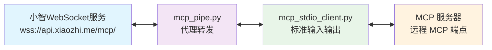

# xiaozhi-mcp-proxy 小智AI MCP代理工具

一个可以把通用MCP Server代理转换成小智AI MCP接入点协议的工具，拓展小智AI MCP接入能力。

## 概述

此项目基于小智AI官方项目[mcp-calculator](https://github.com/78/mcp-calculator)代码升级开发而来。
新增了 `mcp_stdio_client.py` 文件，可以将MCP `streamable-http` 类协议进行代理转发给小智AI。

## 架构设计


## Quick Start | 快速开始

1. Install dependencies | 安装依赖:
```bash
pip install -r requirements.txt
```

2. 设置环境变量:
```bash
export MCP_ENDPOINT=<your_mcp_endpoint>
export MCP_URL=<your_mcp_server_url>

#注意 MCP_URL是指的 MCP server 地址，目前仅支持【streamable-http】类型，示例如下：
#{
#  "mcpServers": {
#    "streamable-mcp-server": {
#      "type": "streamable-http",
#      "url": "http://127.0.0.1:12306/mcp" #MCP_URL 
#    }
#  }
#}
```

3. 运行示例:
```bash
python mcp_pipe.py mcp_stdio_client.py
```

## 项目结构

- `mcp_pipe.py`:  处理WebSocket连接和进程管理的主通信管道
- `mcp_stdio_client.py`: 可以将MCP `streamable-http` 类协议进行代理转发给小智AI
- `requirements.txt`: 项目依赖


## 使用场景

- 所有支持MCP server的服务，例如接入mcp-chrome 通过小智AI控制和操作浏览器

## 案例1：接入MCP-Chrome 实现浏览器自动化
1. 请打开[mcp-chrome](https://github.com/hangwin/mcp-chrome/blob/master/README_zh.md)项目，仔细阅读教程，安装和配置 Chrome MCP Server服务。
默认得到的配置如下:
```
{
  "mcpServers": {
    "streamable-mcp-server": {
      "type": "streamable-http",
      "url": "http://127.0.0.1:12306/mcp" #MCP_URL 
    }
  }
}

```
2. 打开 xiaozhi.me后台 获取小智AI MCP接入点:

``` bash
# MCP_ENDPOINT
wss://api.xiaozhi.me/mcp/?token=<your-token>
```

3. 复制1和2步骤中的变量，在命令行执行:

```bash
export MCP_ENDPOINT=<your_mcp_endpoint>
export MCP_URL=<your_mcp_server_url>
python mcp_pipe.py mcp_stdio_client.py

```
``` bash
#成功运行日志
2025-07-02 16:05:37,639 - MCP_PIPE - INFO - Connecting to WebSocket server...
2025-07-02 16:05:37,977 - MCP_PIPE - INFO - Successfully connected to WebSocket server
2025-07-02 16:05:37,995 - MCP_PIPE - INFO - Started mcp_stdio_client.py process
2025-07-02 16:05:38,221 - INFO - MCP 客户端启动，连接到: http://127.0.0.1:12306/mcp
2025-07-02 16:05:38,223 - INFO - 收到输入: {"id":0,"jsonrpc":"2.0","method":"initialize","params":{"protocolVersion":"2024-11-05","capabilities...
2025-07-02 16:05:38,232 - INFO - 获得 MCP 会话ID: 21aace19-*****-92e6-3394b2c52c96
2025-07-02 16:05:38,232 - INFO - 输出响应: {"result": {"protocolVersion": "2024-11-05", "capabilities": {"tools": {}}, "serverInfo": {"name": "...
2025-07-02 16:05:38,232 - INFO - 发送自动 tools/list 请求
2025-07-02 16:05:38,738 - INFO - 自动输出 tools/list 响应: {"result": {"tools": [{"name": "get_windows_and_tabs", "description": "Get all currently open browse...
2025-07-02 16:05:38,738 - INFO - ✅ 自动获取了 23 个 MCP 工具
```
4. 演示效果，点击下方图片观看演示视频：
[](https://www.bilibili.com/video/BV1ZS3szLEGT/)

## 环境要求

- Python 3.7+
- websockets>=11.0.3
- python-dotenv>=1.0.0
- mcp>=1.8.1
- pydantic>=2.11.4

## 贡献指南

Contributions are welcome! Please feel free to submit a Pull Request.

欢迎贡献代码！请随时提交Pull Request。

## License 

本项目采用MIT许可证 - 详情请查看LICENSE文件。

